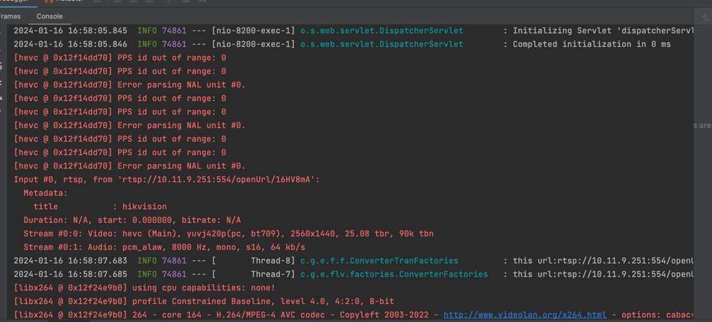
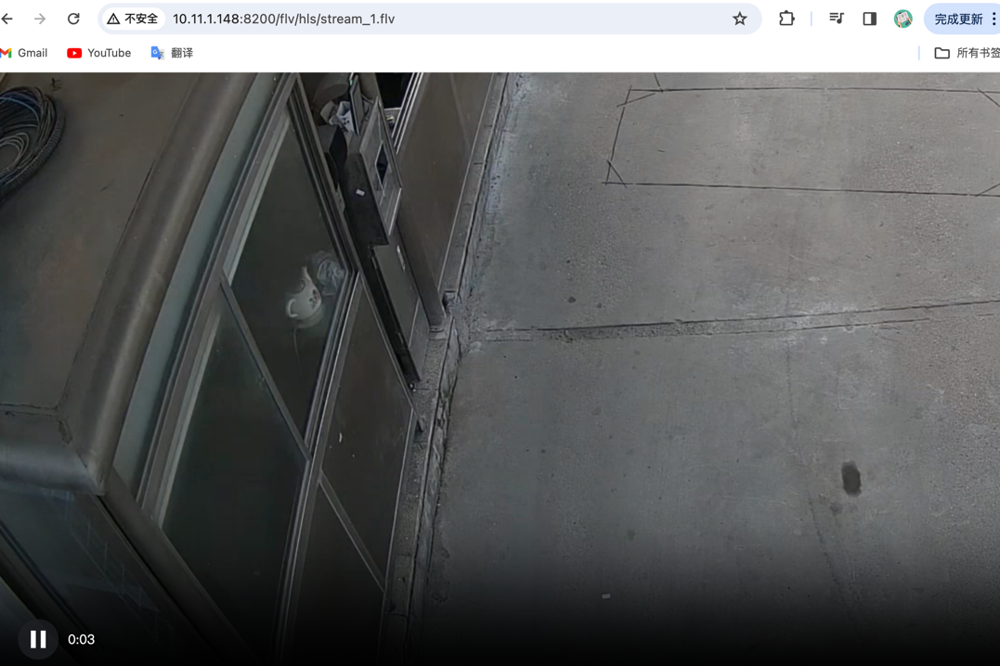

# Easy-FLV

#### 项目介绍
rtsp、rtmp流地址转换成flv浏览器播放

极速开始
-------------------------------------
以下例子基于Spring Boot

### 第一步：添加Maven依赖

直接添加以下maven依赖即可

```xml
<dependency>
    <groupId>io.github.javpower</groupId>
    <artifactId>rtsp-converter-flv-spring-boot-starter</artifactId>
    <version>1.5.9.1</version>
</dependency>
```
### 第二步：实现interface
数据库里面存储要播放的rtsp、rtmp流地址和自定义的通道号 实现类中通过通道号查询出地址<br>
```java
@Service
public class RtspDataService implements IOpenFLVService {


    @Override
    public String getUrl(Integer channel) {
        //todo: 根据自定义的channel获取rtsp视频流地址
        return "rtsp://10.11.9.251:554/openUrl/16HV8mA";
    }
}
```
### 第三步：配置yml
```yml
easy.flv.host=http://localhost:8200
```
### 第四步：实现interface使用

- 流转换地址：GET http://ip:port/get/flv/hls/stream_{channel}.flv
- 浏览器直接播放测试： GET http://ip:port/flv/hls/stream_{channel}.flv

### 第五步：不想实现interface使用
  原地址：rtsp://XXXXXXXX <br>
```Java
public static void main(String[] args) throws UnsupportedEncodingException {

        String url = "rtsp://XXXXXXXX";
        String encodedUrl = java.net.URLEncoder.encode(url, "UTF-8");
        System.out.println("编码：" + encodedUrl);
}   
```
- 流转换地址：GET http://ip:port/get/flv/hls/stream?url=编码后的地址
- 浏览器直接播放测试： GET http://ip:port/flv/hls/stream?url=编码后的地址



